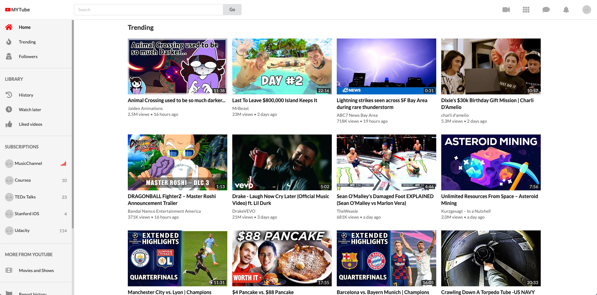
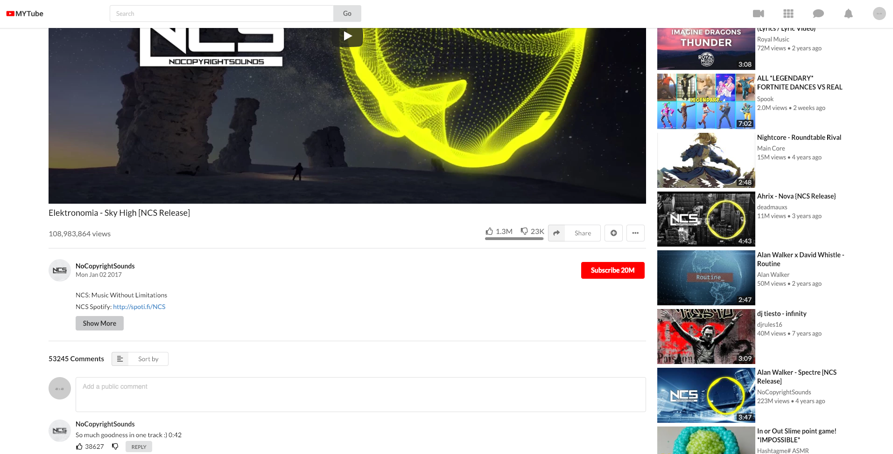

# 1 Simple YouTube-Clone using React

# 2 Screenshots

UI-wise this application looks **almost exactly like the original Youtube application**

It uses real data by leveraging the [Youtube Data API v3](https://developers.google.com/youtube/v3/docs/).





# 3 How to run this application

This application loads information using the [Youtube Data API v3](https://developers.google.com/youtube/v3/docs/).

To use it, you need to set up a [Youtube Data v3 API key](https://productioncoder.com/build-youtube-in-react-part-19/) and run the project with `npm` or `yarn`.

**Below, you'll find a step by step explanation**

## 3.1. Getting a Youtube Data API key

1. Head over to the [Google developers console](https://console.developers.google.com)
2. Create a new project by clicking on `Select project` drop down right next to the logo. Click the `New Project` button an give it a speaking name.
3. Select your project by choosing it in the `Select Dropdown` directly next to the logo in the header.
4. Click the `Enable APIs and Services` button
5. Search for `youtube data`
6. Click on the `Youtube Data API v3`
7. Click the blue enable button
8. In the dashboard, click `Credentials` on the left sidebar
9. Click the `Create Credential` button
10. Which API are you using: `Youtube Data API v3`
11. Where will you be calling the API from: `Web browser`
12. What data are you accessing: `Public data`
13. Click the `What credentials do I need button`
14. Copy the API key

## 3.2. Providinng the API key to your application

### Creating Environment variable

Provide your Youtube Data API key with the `REACT_APP_YT_API_KEY` environment variable.

Create a `.env.local` file (alread gitignored) with

and then define the `REACT_APP_YT_API_KEY` environment variable which is supposed to hold your `Youtube Data v3 API` key in the `.env.local` file like so:

```
REACT_APP_YT_API_KEY=AIzaxxxxxxxxxxxxxxxxxxxxxxxxxxxxxxxxxx
```


## 3.3. Installing dependencies

To install the dependencies run

```
npm install
```

With [yarn](https://yarnpkg.com/lang/en/)

```
yarn install
```

## 3.4 Running the application

### 3.4.1 Running locally with local env vars

You can run:
```
npm run dev
```

which will source your `.env.local` file and then start then run `npm start`.

Note that if you change the value of the `.env.local` file, you need to run `npm run dev` again so that the new env var changes are picked up.

As an alternative, you can manually source the `.env.local` file with

```
source .env.local
```

and then run

```
npm start
```

You can also use [yarn](https://yarnpkg.com/lang/en/) to run the application.

```
yarn start
```

**If you close the terminal, you will need to source the file again. That's why it is recommended to just run `npm run dev` so you don't need to think about it**.


# 4 Tests

This project contains an extensive suite of tests and makes use of [Jest](https://jestjs.io/) and [Enzyme](https://github.com/airbnb/enzyme).

Run all tests by executing.

```
npm test
```

You can also use [yarn](https://yarnpkg.com/lang/en/) to run the tests.

```
yarn test
```

# 5 Features

This application includes the major features of Youtube such as

- home feed with infinite scroll
- trending videos
- searching for videos
- watching videos
- displaying comments and video details

# 6 Used technologies

- [React / create-react-app](https://github.com/facebook/create-react-app)
- [Redux](https://redux.js.org/)
- [Redux-saga](https://redux-saga.js.org/)
- [Redux-reselect](https://github.com/reduxjs/reselect)
- [Jest](https://jestjs.io/)
- [Enzyme](https://airbnb.io/enzyme/)
- [Semantic UI](https://react.semantic-ui.com/)
- CSS Grid / Flexbox
